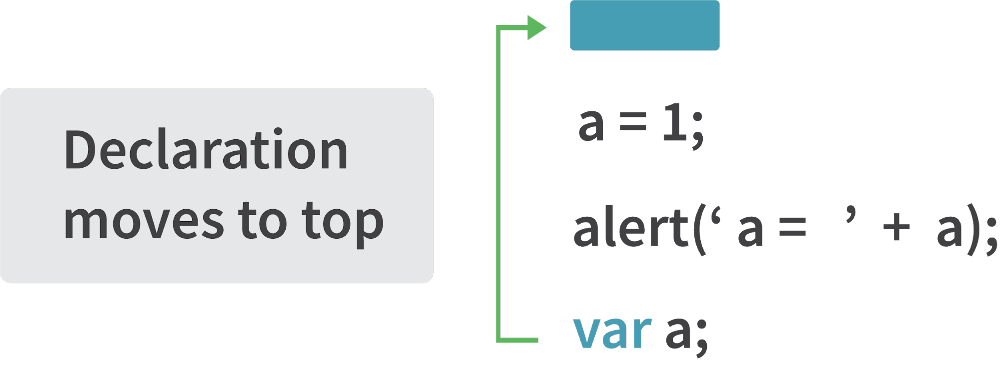
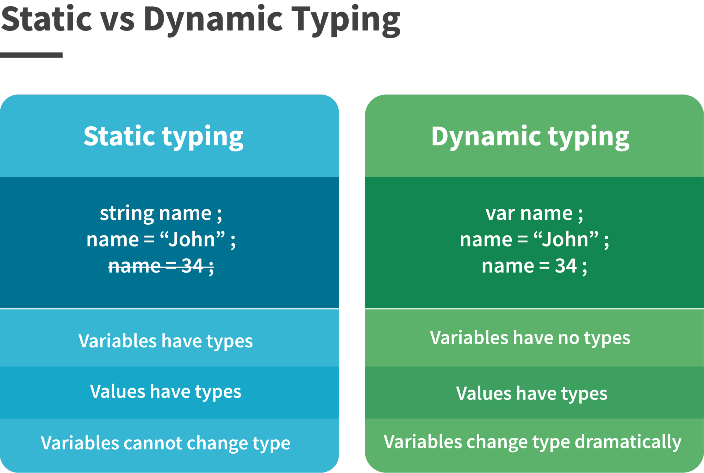
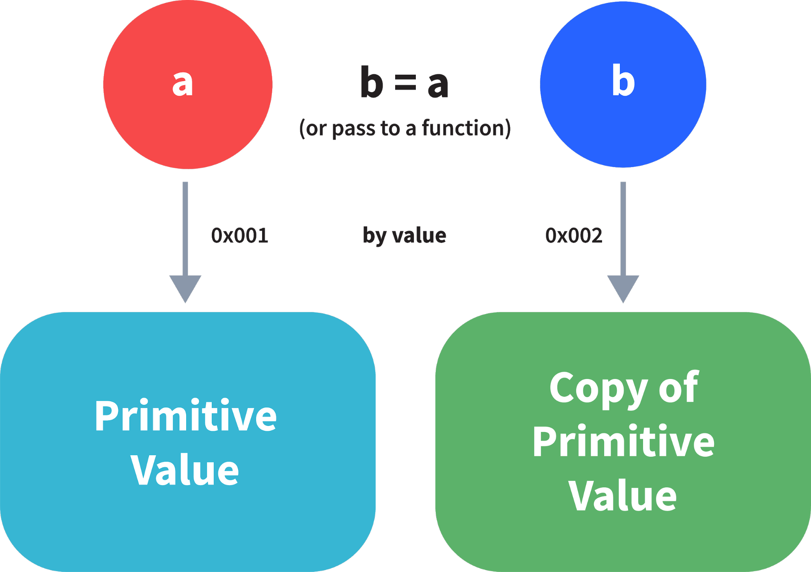
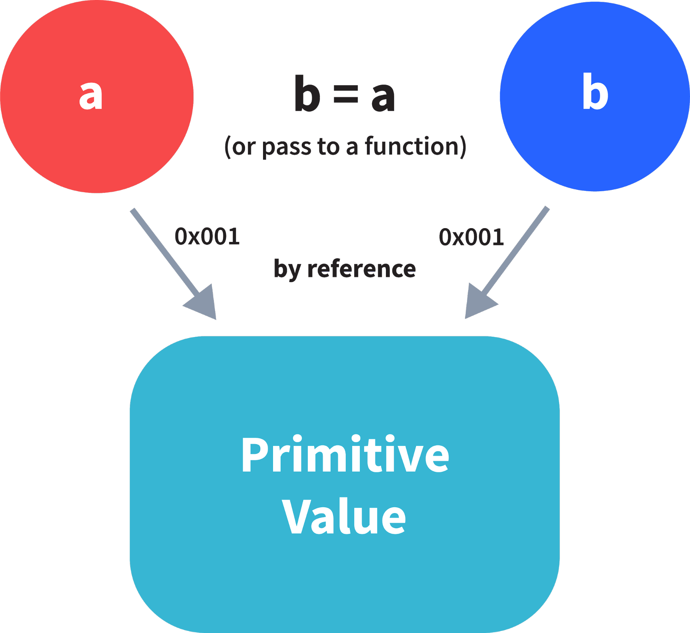

# JavaScript


Được phát triển bởi Brendan Eich vào năm 1995, JavaScript là một trong những ngôn ngữ lập trình phổ biến nhất với các web developer.

Nó được tạo ra cho phát triển các trang web động. Một chương trình JS được gọi là script, nó có thể đính kèm với bất kỳ trang web HTML nào. Các script sẽ tự động chạy khi trang được tải.

Ở hiện tại JavaScript cũng có thể chạy được trên cả server hay bất kỳ thiết bị nào có JavaScript Engine.

### 1. Sự khach biệt giữa các kiểu dữ liệu trong JavaScript?

Trong JavaScript các kiểu dữ liệu được chia làm hai loại là kiểu nguyên thủy và đối tượng. Để biết kiểu dữ liệu của các biến JavaScript, ta có thể sử dụng **typeof**.

**Kiểu nguyên thủy**

**_*String*_** - biểu diễn một mảng ký tự hay một chuỗi. Kiểu chuỗi trong JavaScript có thể sử dụng một cặp dấu ngoặc kép hoặc dấu ngoặc kép đơn.

```js
var str = "Vivek Signh Bisht"; // sử dụng dấu ngoặc kép
var str2 = "John Doe"; // Sử dụng dấu ngoặc đơn
```

**_*Number*_** - biểu diễn cả số nguyên và số thực.

```js
var x = 3; // số nguyên
var y = 3.6; // số thực
```

**_*BigInt*_** - kiểu dữ liệu này được sử dụng để lưu trữ các số vượt quá giới hạn của kiểu dữ liệu Number. Nó có thể lưu trữ các số nguyên lớn và được biểu diễn bằng cách thêm "n" vào một số nguyên.

```js
var bigInteger = 23456789012345678901234567890;
```

**_Boolean_** - kiểu luận lý, có hai giá trị _true_ và _false_. Thường được dùng với điều kiện.

```js
var a = 2;
var b = 3;
var c = 2;
(a == b)(
  // trả về false
  a == c
); // trả về true
```

**_undefined_** - khi giá trị của một biến là không xác định.

```js
var x; // giá trị của x là undefined
var y = undefined; // ta cũng có thể gán một biến là undefined
```

**_null_** - biểu diễn giá trị null. Vì JavaScript là case-sensitive, null sẽ không giống với `Null`, `NULL`, hoặc bất kỳ biến thể khác.

```js
var z = null;
```

**_symbol_** - mới được giới thiệu trong ES6. Nó lưu trữ các giá trị duy nhất và ẩn danh.

```js
var symbol1 = Symbol("symbol");
```

sử dụng `typeof` để tìm kiểu nguyên thủy:

```js
typeof "John Doe"; // Return "string"
typeof 3.14; // Return "number"
typeof true; // Return "boolean"
typeof 2345678901234567890123456789; // Return bigint
typeof undefined; // Return "undefinded"
typeof null; // Return "object" (đặc trưng của JavaScript)
typeof Symbol("symbol"); // Return symbol
```

Trong JavaScript nếu dữ liệu không phải là kiểu nguyên thủy thì tất cả đều là object.

**Object** dùng để lưu tập hợp dữ liệu

```js
// Tập hợp dữ liệu dạng key-value

var obj1 = {
  x: 43,
  y: "Hello World!",
  z: function () {
    return this.x;
  },
};

// Tập hợp dữ liệu dạng danh sách

var array1 = [5, "Hello", true, 4.1];
```

### 2. Giải thích về Hoisting trong JavaScript?

Hoisting là một hành vi mặc định trong JavaScript, nó sẽ chuyển tất cả khai báo biến và hàm lên trên cùng.



Điều này có nghĩa là bất kể hàm và biến được khai báo ở đâu, chúng cũng sẽ được chuyển lên đầu scope. Scope có thể là toàn cục hoặc cục bộ.

Ví dụ 1:

```js
hoistedVariable = 3;
console.log(hoistedVariable);
// output là 3 vì biến được khởi tạo trước khi khai báo.
var hoistedVariable;
```

Ví dụ 2:

```js
hoistedFunction();
// Outputs "Hello World!" kể cả khi hàm được khai báo sau khi gọi.

function hoistedFunction() {
  console.log("Hello World!");
}
```

Ví dụ 3:

```js
// Hoisting takes place in the local scope as well
function doSomething() {
  x = 33;
  console.log(x);
  var x;
}
```

_Lưu ý_: Khai báo biến được hoisting chứ phép gán biến thì không.

```js
var x;
console.log(x); // Output sẽ trả về "undefined" vì phép gán không được hoisting
x = 23;
```

_Lưu ý_: Để tránh hoisting bạn có thể sử dụng "use strict"

```js
"use strict";
x = 23; // Báo lỗi x chưa được khai báo
var x;
```

### 3. Sự khác biệt giữa toán tử "==" và "===" là như thế nào?

Cả hai đều dùng để so sánh, nhưng "==" có thể dùng với bất kỳ kiểu dữ liệu nào còn "===" chỉ dành cho cùng kiểu.

```js
var x = 2;
var y = "2";

(x == y) // True
(x ===) // False vì typeof x là "number", typeof y là "string"
```

### 4. Giải thích về ép kiểu ngầm trong JavaScript?

Ép kiểu ngầm trong JavaScript là sự chuyển đổi tự động của giá trị từ kiểu dữ liệu này sang kiểu dữ liệu khác. Nó xảy ra khi thực hiện một biểu thức với các kiểu dữ liệu khác nhau.

**Ép kiểu string**

Ép kiểu string xẩy ra khi dùng toán tử `+`. Một số cộng với một chuỗi, kiểu số sẽ bị ép thành kiểu chuỗi.

Ví dụ:

```js
var x = 3;
var y = "3";
x + y; // return "33"
```

```js
var x = 24;
var y = "Hello";
x + y; // Return "24Hello"
```

Để hiểu về hai ví dụ khi ta cộng một số vào chuỗi, thì khi JavaScript thấy biểu thức `x+y` với hai kiểu khác nhau (một số và một chuỗi), nó sẽ chuyển đổi kiểu số thành chuỗi để thực hiện hành động. Sau khi chuyển đổi, cả hai biến đều là kiểu chuỗi, thao tác `+` lúc này sẽ thành phép nối chuỗi kết quả là ra chuỗi "33" và "24Hello".

Ngược lại, khi thực hiện phép toán "-", thì chuõi lại bị ép kiểu ngầm thành số. Ví dụ:

```js
var x = 3;
var y = "3";
x - y; // Returns O since the variable y (string type) is converted to a number type
```

**Ép kiểu Boolean**

Ép kiểu boolean xảy ra khi sử dụng các toán tử logic, lệnh if hay kiểm tra vòng lặp. Để hiểu về ép kiểu logic, ta cần hiểu về giá trị _truthy_ và _falsy_.

Giá trị _truthy_ là cái sẽ được ép thành **true**. Còn _falsy_ sẽ được ép kiểu thành **false**.

Tất cả các giá trị ngoại trừ `0`, `0n`, `-0`, `""`, `null`, `undefines`, và `NaN` thì đều là truthy.

Câu lệnh if:

```js
var x = 0;
var y = 23;
if (x) {
  console.log(x);
} // The code inside this block will not run since the value of x is 0 (Falsy)
if (y) {
  console.log(y);
} // The code inside this block will run since the value of y is 23 (Truthy)
```

Toán tử logic:

Tóa tử logic trong JavaScript không giống các ngôn ngữ lập trình khác, **nó không trả về true hay false, mà nó trả về một toán hạng**.

OR ( || ) - Nếu giá trị đầu tiên là truthy, giá trị đầu tiên sẽ được trả về, ngược lại nó trả về giá trị thứ hai.

AND ( && ) - Nếu hai giá trị đều là truthy, giá trị thứ hai sẽ được trả về. Nếu giá trị đầu là falsy thì sẽ trả về giá trị đầu hoặc giá trị thứ hai là falsy sẽ trả về giá trị thứ hai.

Ví dụ:

```js
var x = 220;
var y = Hello;
var z = undefinded;

x || y; // Returns 220 since the first value is truthy
x || z; // Returns 220 since the first value is truthy
x && y; // Returns "Hello" since both the values are truthy
y && z; // Returns undefined since the scond value is falsy

if (x && y) {
  console.log("Code runs"); // This block runs because x && y returns "Hello" (Truthy)
}

if (x || z) {
  console.log("Code runs"); // This block runs because x || y returns 220 (Truthy)
}
```

**Ép kiểu bảng**

Xảy ra khi thực hiện phép "==". Nhớ lại thì phép **"==" được dùng để so sánh hai giá trị khác kiểu**,

Thực tế khi sử dụng "==" một ép kiểu ngầm đã xảy ra, chuyển đổi tất cả toán hạng về cùng kiểu và so sánh chúng.

Ví dụ:

```js
var a = 12;
var b = "12";
a == b; // Returns true because both 'a' and 'b' are converted to the same type and then compared. Hence the operands are equal.
```

### 5. JavaScript là ngôn ngữ kiểu tĩnh hay động?

JavaScript là ngôn ngữ kiểu động. Trong ngôn ngữ kiểu động, kiểu dữ liệu của biến được kiểm tra trong khi đang chạy chương trình ngược lại với kiểu tĩnh, nơi kiểu dữ liệu của biến được kiểm tra khi biên dịch.



Vì JavaScript là ngôn ngữ kiểu động, nên một biến có thể giữ bất kỳ kiểu dữ liệu. Ví dụ:

```js
var a = 23;
var a = "Hello World!";
```

### 6. Thuộc tính NaN trong JavaScript là gì?

Thuộc tính NaN biểu diễn một giá trị **Not-a-Number**. Nó biểu thị một gía trị không phải là số.

`typeof` của NaN trả về `Number`. Muốn kiểm tra một giá trị có phải NaN không, có thể dùng hàm `isNaN()`.

Ví dụ:

```js
isNaN("Hello"); // Returns true
isNaN(345); // Return false
isNaN("1"); // Return false, since '1' is converted to Number type which results in 0 (a number)
isNaN(false); // Return false vì false trả về 0 và true trả về 1
isNaN(undefined); // Return true vì undefined không phải là một giá trị số hợp lệ, và khi được chuyển đổi thành số Number(undefined) nó trở thành NaN.
```

### 7. Giải thích về phép gán qua giá trị và phép gán qua tham chiếu ?

Trong JavaScript, kiểu dữ liệu nguyên thủy được gán với giá trị, còn kiểu đối tượng được gán bằng tham chiếu.

Trước tiên, ta cần hiểu về điều gì xảy ra khi ta tạo một biến và gán giá trị cho nó.

```js
var x = 2;
```

Trong ví dụ trên, ta tạo một biến `x` và gán nó giá trị là "2", phép "=" chỉ định một vài không gian trong bộ nhớ, để lưu trữ giá trị là "2" và trả về vị trí được chỉ định trong bộ nhớ. Do đó, biến `x` ở trên trỏ đến vị trí trong bộ nhớ thay vì trỏ trực tiếp đén giá trị 2.

Phép gán thực hiện hành vi khác nhau khi làm việc với kiểu nguyên thủy và kiểu đối tượng.

**Phép gán với kiểu nguyên thủy**



```js
var y = 234;
var z = y;
```

Ở ví dụ này, dòng đầu phép gán giá trị cho `y` là kiểu nguyên thủy, sau đó ở dòng thứ hai, giá trị của `y` được gán cho `z`. Phép gán chỉ định một vùng không gian mới trong bộ nhớ và trả về địa chỉ của nó. Do đó, biến `z` không chỉ đến vị trí của biến `y` thay vào đó nó chỉ đến vùng không gian mới trong bộ nhớ.

```js
var y = #8454; // y pointing to address of the value 234
var z = y;
var z = #5411; // z pointing to a completely new address of the value 234

// Changing the value of y
y = 23;
console.log(z); // Return 234, since z points to a new address in the memory so changes in y will not effect z
```

Kiểu dữ liệu nguyên thủy khi được truyền cho một biến khác sẽ được truyền theo giá trị. Thay vì chỉ gán cùng một địa chỉ cho một biến khác, giá trị sẽ được gán và không gian bộ nhớ mới được tạo ra.

**Phép gán với kiểu đối tượng**



```js
var obj = { name: "Vivek", surname: "Bisht" };
var obj2 = obj;
```

Trong ví dụ trên, phép gán truyền trực tiếp vị trí của biến `obj` đến biến `obj2`. Nói cách khác, tham chiếu của biến `obj` được chuyển cho biến `obj2`.

```js
var obj1 = #8711;
var obj2 = obj;
var obj2 = #8711; // obj2 pointing to the same address

// Changing the value of obj1
obj1.name = "Akki";
console.log(obj2); // Return {name: "Akki", surname: "Bisht"} since both the variables are pointing to the same address.
```

Trong khi truyền các kiểu dữ liệu đối tượng, phép gán trực tiếp truyền địa chỉ (tham chiếu).

Do đó, các kiểu dữ liệu đối tượng luôn được truyền bằng tham chiếu.

### 8. IIFE là gì trong JavaScript ?

Immediately Invoked Function Expression (IIFE) là một hàm được chạy ngay sau khi nó được định nghĩa.

Cú pháp của IIFE:

```js
(function () {
  // Do something;
})();
```

Để hiểu về IIFE, trước hết cần hiểu về hai dấu ngoặc đơn được thêm vào để tạo IIFE.

Dấu ngoặc đơn đầu tiên:

```js
(function () {
  //Do something;
});
```

Khi thực thi code javascript, bất cứ khi nào trình biên dịch bắt gặp từ "function" nó cũng sẽ cho rằng ta đang khai báo một function. Do đó, nếu ta không dùng dấu ngoặc đơn, trình biên dịch sẽ báo lỗi vì nó nghĩa ta đang khái báo một function và theo cú pháp thì các function buộc phải có tên.

Để tránh lỗi ta thêm dấu ngoặc đơn vào để trình biên dịch biết đây không phải là khai báo function mà là một biểu thức function.

Dấu ngoặc đơn thứ hai:

```js
(function () {
  //Do something;
})();
```

Từ định nghĩa IIFE, ta biết rằng code sẽ chạy ngay sai khi khai báo. Một function chỉ chạy khi nó được gọi. Nếu ta không gọi, thì chúng ta chỉ nhận về được khai báo hàm.

Do đó để gọi function ta sử dụng dấu ngoặc đơn thứ hai.

### 9. Giải thích về HOC (Higher Order Functions) trong JavaScript ?

Các hàm hoạt động trên các hàm khác bằng cách sử dụng chúng là tham số hoặc kết quả trả về thì được gọi là Higher Order Functions - HOC. Ví dụ:

```js
function higherOrder(fn) {
  fn();
}

higherOrder(function () {
  console.log("Hello World");
});
```

```js
function higherOrder2() {
  return function () {
    return "Do something";
  };
}

var x = higherOrder2();
x(); // Returns "Do something"
```

### 10. Giải thích về "this" trong JavaScript ?

Từ khóa "this" trong JavaScript tham chiếu đến một đối tượng có thuộc tính là một hàm.

Giá trị của "this" phụ thuộc vào đối tượng đang gọi hàm.

Ví dụ 1:

```js
function doSomething() {
  console.log(this);
}

doSomething();
```

Như vậy theo định nghĩa, "this" tham chiếu đến một đối tượng có hàm là thuộc tính. Vậy trong đoạn code trên hàm là thuộc tính của đối tượng nào?

Vì hàm được gọi từ ngữ cảnh tổng thể, nên **hàm sẽ là thuộc tính của đối tượng toàn cục**. Do đó, nếu ta chạy đoạn code trên trình duyệt kết quả sẽ là **window object**.

Ví dụ 2:

```js
var obj = {
  name: "vivek",
  getName: function () {
    console.log(this.name);
  },
};

obj.getName();
```

Trong đoạn code này, hàm `getName` là thuộc tính của `obj`. Do đó, **this** sẽ tham chiếu đến đối tượng `obj`, và output sẽ là "vivek".

Ví dụ 3:

```js
var obj = {
  name: "vivek",
  getName: function () {
    console.log(this.name);
  },
};

var getName = obj.getName;
var obj2 = { name: "akshay", getName };
obj2.getName();
```

Output sẽ là "akshay. Mặc dù hàm "getName" được khai báo trong đói tượng `obj`, nhưng ở thời điểm gọi thì `getName()` lại là thuộc tính của `obj2`, do đó "this" sẽ tham chiếu đến `obj2`.

Cách ngớ ngẩn để hiểu "this" là, bất cứ khi nào hàm được gọi, hãy kiểm tra đối tượng trước dấu chấm. Giá trị của this sẽ luôn là đối tượng trước dấu chấm.

Nếu không có đối tượng nào như ví dụ 1, giá trị sẽ là đối tượng toàn cục.

Ví dụ 4:

```js
var obj1 = {
  address: "Mumbai, India",
  getAddress: function () {
    console.log(this.address);
  },
};

var getAddress = obj1.getAddress;
var obj2 = { name: "akashay" };
obj2.getAddress();
```

Kết quả sẽ là lỗi, vì từ khóa "this" tham chiếu đến đối tượng `obj2`, nhưng `obj2` không có thuộc tính "address", do đó hàm `getAddress` sẽ xảy ra lỗi.

### 11. Giải thích về phương thức call(), apply() và bind() trong JavaScript?

Ba phương thức phổ biến sử dụng để thay đổi ngữ cảnh của từ khóa "this" trong các hàm. Tham số đầu tiên của cả ba là một object được chỉ định bởi "this" ...

#### call()

Đó là một phương thức được xác định trước trong JavaScript. Phương thức call() dùng để gọi một hàm ngay lập tức và thay đổi giá trị của từ khóa "this" trong hàm đó. Tham số thứ 2 là một danh sách các chỉ mục.

Ví dụ 1:

```js
function sayHello() {
  return "Hello" + this.name;
}

var obj = { name: "Sandy" };

sayHello.call(obj); // Returns "Hello Sandy"
```

Phương thức call() cho phép một đối tượng sử dụng phương thức của đối tượng khác.

Ví dụ 2:

```js
var person = {
  age: 23,
  getAge: function () {
    return this.age;
  },
};

var person2 = { age: 54 };
person.getAge.call(person2); // Returns 54
```

call() chấp nhận tham số:

```js
function saySomething(message) {
  return this.name + " is " + message;
}

var person4 = { name: "John" };
saySomething.call(person4, "awesome"); // Returns "John is awesome"
```

### apply()

Tương tự như phương thức call(). Nhưng khác ở điểm **phương thức call() nhận các tham số riêng biệt, trong khi apply() nhận tham số là một mảng**.

```js
function saySomething(message) {
  return this.name + " is " + message;
}

var person4 = { name: "John" };
saySomething.apply(person4, ["awesome"]);
```

### bind()

Phương thức này trả về một hàm mới (bản sao của hàm), trong đó giá trị của "this" sẽ được liên kết với đối tượng sở hữu, được cung cấp dưới dạng một tham số.

Ví dụ:

```js
var bikeDetails = {
  displayDetails: function (registrationNumber, brandName) {
    return (
      this.name +
      " , " +
      "bike details: " +
      registrationNumber +
      " , " +
      brandName
    );
  },
};

var person1 = { name: "Vivek" };
var detailsOfPerson1 = bikeDetails.displayDetails.bind(
  person1,
  "TS0122",
  "Bullet"
);

// Binds the displayDetails function to the person1 object

detailsOfPerson1();
// Returns Vivek, bike details: TS0452, Thunderbird
```
